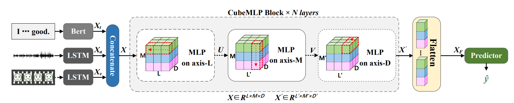
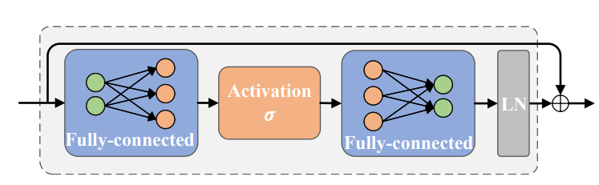

# CubeMLP
The implementation of CubeMLP: A MLP-based Model for Multimodal Sentiment Analysis and Depression Estimation

The CubeMLP is a pure MLP structure for multimodal processing, which is simple yet effective.
Specifically, CubeMLP consists of three independent MLP units, each of which has two affine transformations.
CubeMLP accepts all relevant modality features as input and mixes them across three axes (sequential axis, channel axis, and modality axis). 
After extracting the characteristics using CubeMLP, the mixed multimodal features are flattened for task predictions.
The overview of CubeMLP is shown as:

And each MLP unit is composed of two separate fully-connected layer with activations:


The codes require the PyTorch and numpy installation.

To run the codes:
```
python Train.py --dataset mosi_SDK --batch_size 128 --features_compose_t mean --features_compose_k cat --d_hiddens 50-3-128=10-3-32  --d_outs 50-3-128=10-3-32 --res_project 1-1 --bias --ln_first  -dropout_mlp 0.1-0.1-0.1 --dropout 0.1-0.1-0.1-0.1 --bert_freeze part --bert_lr_rate 0.01  --learning_rate 4e-3
```

The MOSI processed dataset has been uploaded to Baidu Disk: https://pan.baidu.com/s/1CRbE4rPUhEfmCysuY4_q3A Code: rif6


For the MOSEI dataset, we cannot directly upload it to Baidu Disk for the file-size limitation.
If you need the dataset, just contact me: sunhaoxx@zju.edu.cn

